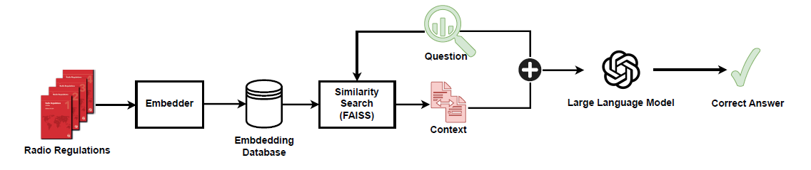
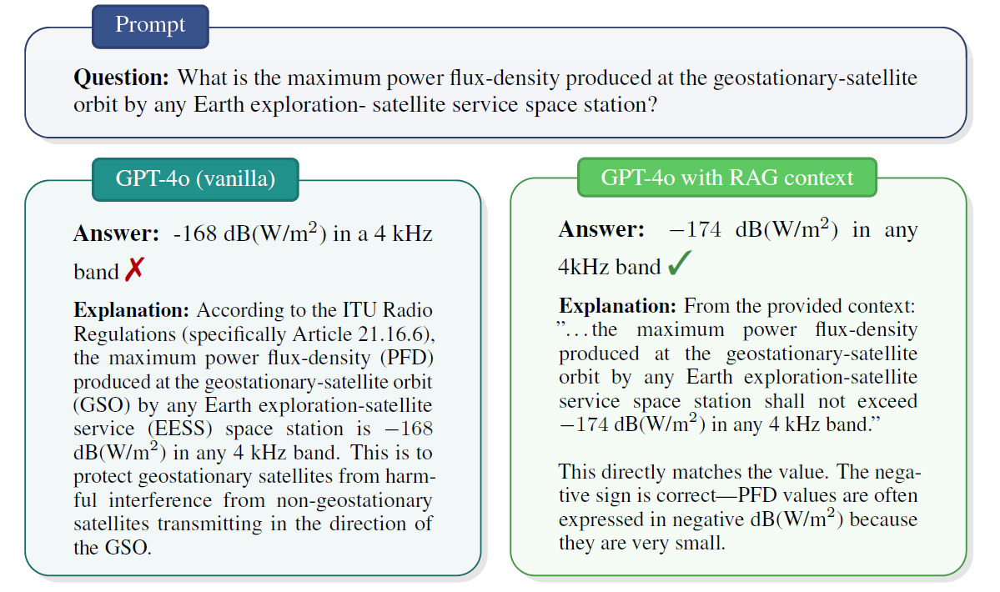

# Radio-RAG

Retrieval-Augmented Generation (RAG) for **radio regulations** (e.g., ITU rules and spectrum management).  
Index regulation PDFs with FAISS, retrieve the most relevant passages, and generate grounded answers with an LLM.

  <!-- Prefer PNG for inline rendering; keep a PDF link as fallback -->
  

---

## Table of Contents

- [Overview](#overview)
- [Features](#features)
- [Quick Start](#quick-start)
- [Project Structure](#project-structure)
- [Usage](#usage)
  - [Examples](#examples)
  - [Common Arguments](#common-arguments)
- [Experiments](#experiments)
- [Hugging Face (ZeroGPU)](#hugging-face-zerogpu)
- [Figures](#figures)
- [Troubleshooting](#troubleshooting)
- [License](#license)

---

## Overview

**Radio-RAG** implements a practical RAG pipeline tailored for telecom/spectrum regulations:

1. **Ingest** regulation PDFs and split them into chunks.  
2. **Embed** those chunks and build a **FAISS** index.  
3. **Retrieve** the most relevant passages for a user question.  
4. **Generate** grounded answers with an LLM using the retrieved context.

---

## Features

- 🔎 **PDF → chunks → FAISS**: simple, configurable ingestion pipeline  
- 🧠 **Model-agnostic**: choose your embedding and LLM backends  
- ⚙️ **Tunable retrieval**: chunk size, overlap, index type, top-K  
- 🧪 **Experiment ready**: compare vanilla LLM vs. RAG-augmented runs

---

## Quick Start

### 1) Install

~~~bash
git clone https://github.com/Zakaria010/Radio-RAG.git
cd Radio-RAG

# (optional) create a virtual environment
python -m venv .venv
source .venv/bin/activate    # Windows: .venv\Scripts\activate

pip install -r requirements.txt
~~~

### 2) Add your PDFs

Create the `data/` folder (if it doesn’t exist) and put your regulation PDFs inside:

~~~text
data/
├─ itu_radio_regulations.pdf
└─ your_other_regulation_book.pdf
~~~

---

## Project Structure

~~~text
Radio-RAG/
├─ data/                 # Put regulation PDFs here
├─ tests/                # Evaluation / experiment scripts
├─ utils/                # Helpers (parsing, chunking, indexing, retrieval)
├─ local_rag.py          # CLI entry-point
├─ requirements.txt
├─ LICENSE
└─ README.md
~~~

---

## Usage

> Run the built-in help to see the **exact** flags supported by your current version.
~~~bash
python local_rag.py --help
~~~

### Examples

**A) Ask a question (builds or reuses the index)**

~~~bash
python local_rag.py \
  --pdf_folder ./data \
  --question "What is the maximum power flux-density at the GSO produced by any EESS space station?"
~~~

**B) Retrieve context only (no generation) — if supported**

~~~bash
python local_rag.py \
  --pdf_folder ./data \
  --top_k 5 \
  --question "Define the protection criteria for GSO links." \
  --no_generate
~~~

### Common Arguments

- `--pdf_folder` *(str, default: `./data`)* — directory of PDFs  
- `--chunk_size` *(int)* — chunk length used for text splitting  
- `--overlap` *(int)* — overlap between adjacent chunks  
- `--index_type` *(str)* — FAISS index (`flatl2`, `hnsw`, `ivfflat`, `ivfpq`, …)  
- `--embed_model` *(str)* — embedding model ID/name  
- `--llm_model` *(str)* — LLM ID/name  
- `--top_k` *(int)* — number of retrieved chunks  
- `--question` *(str)* — your query  
- `--no_generate` *(flag)* — return retrieved context without generation

> If you change embedding/index parameters or models, **rebuild** the index to avoid stale vectors.

---

## Experiments

Evaluation utilities live in `tests/`. A typical pattern:

~~~bash
python tests/evaluate_rag.py \
  --pdf_folder ./data \
  --top_k 5
~~~

Some versions include a switch like `--norag` to compare **vanilla LLM** vs **RAG**.  
Run:

~~~bash
python tests/evaluate_rag.py --help
~~~

to see the exact options available in your copy.

---

## Hugging Face (ZeroGPU)

Prefer a hosted demo? Try the app on **Hugging Face Spaces** (ZeroGPU spins up on demand):

- ▶️ **Launch the Space:** `https://huggingface.co/spaces/TODO-REPLACE-WITH-YOUR-SPACE`

Add this badge near the top once your Space is live:

~~~markdown

~~~

---

**Figure 5 — Vanilla vs. RAG (Qualitative)**

  

---

## Troubleshooting

- **No/irrelevant answers** → Confirm PDFs parse correctly; try larger `--top_k`; adjust `--chunk_size` / `--overlap`  
- **Index performance** → Start with `flatl2` (baseline) or `hnsw` (fast). IVF variants can help at larger scale  
- **Changed models/params** → Rebuild the index to avoid stale vectors

---

## License

Released under the **MIT License**. See [LICENSE](LICENSE) for details.

